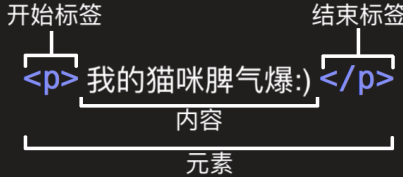
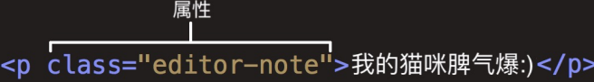

# 初识HTML

## 前端开发

> 学好一门技术关键在于弄清楚它的**历史、局限性和本质**。

**软件的定义：**

一系列按照特定顺序组织的**计算机数据和指令**，是电脑的**非有型部分**。

**软件开发：**

就是告诉计算机**一系列的指令**，这些指令也称之为**程序**。

**软件和应用程序的区别：**

软件包括操作系统及虚拟机、编程（语言）、算法、应用程序等，软件是应用程序的超集。应用程序是一种直接面向用户的软件。


## Web开发

**推荐软件：**

- Chrome：https://www.google.cn/chrome/index.html
- VSCode：https://code.visualstudio.com/
- Xmind：https://www.xmind.cn/
- Typora：https://typora.io/

### 1. 认识网页和网站

网页（Web Page）是浏览器查看到的页面，是一页，包括**文字、链接、图片、音乐、视频**等等。

网站是由**多个网页组成**的。


### 2. 网页的显示过程

**用户角度**

1. 用户在浏览器输入一个网站。
2. 浏览器会找到对应的服务器地址，请求静态资源。
3. 服务器返回静态资源给浏览器。
4. 浏览器对静态资源进行解析和展示。

**前端工程师**

1. 开发项目
2. 打包、部署项目到服务器里面


### 3. 服务器

服务器本质上也是一台类似于电脑的主机，但是有几个**特点**：

- 二十四小时不关机
- 无显示器
- 一般是 Linux 操作系统


### 4. 世界上第一个网页

上世纪90年代，Berners-Lee 上线了世界上第一个网站：

https://info.cern.ch/hypertext/WWW/TheProject.html


### 5. 网页的组成

HTML + CSS + JavaScript


### 6. 浏览器的渲染引擎

浏览器最核心的部分是渲染引擎（Rendering Engine），一般也称为浏览器**内核**。

负责解析网页语法，并渲染（显示）网页。

不同的浏览器内核有不同的解析、渲染规则，所以同一网页在不同内核的浏览器中的渲染效果也可能不同。

**常见的浏览器内核：**

- Trident
- Gecko
- Presto
- **Webkit**
- **Blink**


## 第一个网页

### 1. 认识HTML

超文本标记语言（HyperText Markup Language，HTML）是一种**用于创建网页的标准标记语言**。

**标记语言：**

- 由无数个**标记**（标签、tag）组成。
- 是**对某些内容进行特殊的标记**，以供其他**解释器识别处理**。
- 由**标签和内容**组成的称为**元素。**

**超文本：**

- 不仅仅可以插入普通的文本，还可以插入**图片、音频、视频**等内容。
- 还可以表示**超链接**，从一个网页跳转到另一个网页。

**HTML的后缀名：**

- 以前的 windows 系统的文件拓展名**不能超过3字符**，所以使用 `.htm`
- 现在统一使用 `.html`

**HTML的结构：**

```html
<!doctype html>
<html>
  <head></head>
  <body></body>
</html>
```

用`!`快速生成HTML框架


### 2. VScode

vscode 是微软公司开源的，https://code.visualstudio.com/。

**优点：** 轻量级、灵活、免费

**推荐插件：**

- Chinese
- open in browser、Live Sever

**推荐配置：**

- 当 VScode 遇到注释等一些中文内容的时候，总是会出现黄色的警示框
  - Render non-ASCII characters differently：调整为 false
- 设置自动换行
  - Word Wrap：设置为 true
- 修改缩进方式
  - Tab Size：设置为2


### 3. 元素

元素（Element）是网页的一部分。

一个元素可以包含一个**数据项**，或是一块**文本**，或是一张**照片**，亦或是**什么也不包含**。

查文档：https://developer.mozilla.org/zh-CN/docs/Web/HTML/Reference/Elements

#### 元素的组成

 

#### 元素的属性

 

- 多个属性间用空格来分割
- 有些属性是公共的，如：`class、id、title`
- 有些属性是元素特有的，如：`meta的charset、img的alt`

#### 单（双）标签元素

单标签元素：br、img、hr、meta、input...

双标签元素：html、body、head、h2、p、a...

> HTML元素不区分大小写，但是推荐小写
> 在以前的浏览器单标签规定使用``，后来直接用``即可

#### 元素的嵌套

某些元素的内容可以是文本和其他元素

```html
<ul>
  <li></li>
</ul>
```


### 4. HTML的注释

```html
<!-- 注释内容 -->
```

注释是只给开发者看的，浏览器并不会把注释显示给用户看

快捷键：`ctrl + /`